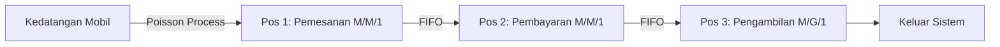

# Laporan Proyek: Analisis & Simulasi Stokastik Sistem Antrean Drive-Thru Restoran Cepat Saji

---

## Anggota Kelompok
1. **[Nama Lengkap Anggota 1]** - NIM: **[NIM Anggota 1]**
2. **[Nama Lengkap Anggota 2]** - NIM: **[NIM Anggota 2]**
3. **[Nama Lengkap Anggota 3]** - NIM: **[NIM Anggota 3]**

*Universitas Gadjah Mada*

---

## 1. Background and Problem Explanation (Latar Belakang & Permasalahan)

Layanan *drive-thru* pada restoran cepat saji dirancang untuk memberikan kemudahan dan kecepatan bagi pelanggan yang ingin membeli makanan tanpa harus turun dari kendaraan. Namun, dalam operasional sehari-hari, restoran sering kali dihadapkan pada masalah antrean yang membludak, terutama pada jam-jam sibuk (*rush hours* seperti makan siang atau makan malam).

Masalah utama pada sistem antrean *drive-thru* adalah adanya **variabilitas stokastik** (ketidakpastian acak) pada dua hal:
1. **Waktu Kedatangan Pelanggan ($\lambda$):** Pelanggan datang secara acak dan tidak teratur.
2. **Waktu Pelayanan ($\mu$):** Waktu yang dibutuhkan untuk memesan makanan, membayar, dan menyiapkan makanan sangat bervariasi tergantung pada jumlah pesanan dan kompleksitas menu.

Jika laju kedatangan mobil melebihi kapasitas pelayanan, antrean akan memanjang hingga ke jalan raya. Dampak negatif dari antrean yang terlalu panjang meliputi:
- **Balking (Kehilangan Pelanggan):** Pelanggan yang melihat antrean terlalu panjang memutuskan untuk pergi (balking), yang langsung mengurangi potensi pendapatan restoran.
- **Kekecewaan Pelanggan:** Waktu tunggu yang terlalu lama menurunkan tingkat kepuasan pelanggan.
- **Kemacetan Lalu Lintas:** Antrean yang meluap ke luar area restoran dapat mengganggu lalu lintas sekitar.

Proyek ini bertujuan untuk mensimulasikan sistem antrean *drive-thru* guna menghitung metrik performa sistem (utilitas kasir, rata-rata waktu tunggu, dan persentase pelanggan yang pergi) serta membandingkan efektivitas sistem **Single-Window** vs. **Dual-Window** menggunakan pendekatan simulasi stokastik.

---

## 2. System Modeling and Theoretical References (Pemodelan Sistem & Landasan Teori)

Sistem antrean *drive-thru* dimodelkan sebagai sebuah **Multi-Stage Queueing Network** (Jaringan Antrean Multi-Tahap) yang terhubung secara seri.

### Notasi Kendall & Distribusi Probabilitas

1. **Laju Kedatangan ($\lambda$):**
   Kedatangan mobil diasumsikan mengikuti **Proses Poisson Homogen** dengan laju rata-rata $\lambda$ kendaraan per menit. Selang waktu antar-kedatangan kendaraan ($t_a$) berdistribusi **Eksponensial**:
   $$f(t_a) = \lambda e^{-\lambda t_a}, \quad t_a \geq 0$$

2. **Pos 1: Pemesanan (Ordering Post - Model $M/M/1$):**
   Waktu pelayanan pemesanan makanan diasumsikan berdistribusi **Eksponensial** dengan rata-rata laju layanan $\mu_{\text{order}}$ mobil per menit.
   $$f(t_{\text{order}}) = \mu_{\text{order}} e^{-\mu_{\text{order}} t_{\text{order}}}$$

3. **Pos 2: Pembayaran (Payment Window - Model $M/M/1$):**
   (Hanya aktif pada konfigurasi Dual-Window). Waktu transaksi pembayaran berdistribusi **Eksponensial** dengan laju layanan $\mu_{\text{pay}}$ mobil per menit.
   $$f(t_{\text{pay}}) = \mu_{\text{pay}} e^{-\mu_{\text{pay}} t_{\text{pay}}}$$

4. **Pos 3: Pengambilan Makanan (Pickup Window - Model $M/G/1$):**
   Waktu penyiapan makanan di dapur dan penyerahan ke pelanggan dimodelkan dengan **Distribusi Lognormal**. Distribusi Lognormal dipilih karena secara fisik waktu penyiapan makanan memiliki batas bawah minimum (tidak mungkin 0 detik) dan memiliki pencilan waktu yang panjang jika ada pesanan khusus.
   Variabel acak $T_{\text{pickup}}$ berdistribusi Lognormal jika $\ln(T_{\text{pickup}})$ berdistribusi Normal $N(\mu_{\log}, \sigma_{\log}^2)$:
   $$f(t) = \frac{1}{t \sigma_{\log} \sqrt{2\pi}} \exp \left( -\frac{(\ln t - \mu_{\log})^2}{2\sigma_{\log}^2} \right)$$
   Di mana parameter $\mu_{\log}$ dan $\sigma_{\log}$ diturunkan dari nilai riil *mean* ($m$) dan standar deviasi ($s$) pelayanan:
   $$\mu_{\log} = \ln\left(\frac{m^2}{\sqrt{m^2 + s^2}}\right), \quad \sigma_{\log} = \sqrt{\ln\left(1 + \frac{s^2}{m^2}\right)}$$

### Fenomena Pembatasan Fisik & Blocking

Dalam teori antrean klasik, antrean dianggap dapat memanjang tanpa batas. Namun, pada *drive-thru* nyata, terdapat keterbatasan kapasitas fisik jalan masuk ($K$). 
- Jika jumlah mobil di dalam sistem mencapai $K$, pelanggan baru yang datang akan melakukan **Balking** (probabilitas masuk antrean menjadi 0).
- Jika Pos 3 (Pickup) sedang sibuk melayani mobil, mobil di Pos 2 (Payment) yang sudah selesai dilayani tidak bisa bergerak maju. Hal ini mengakibatkan Pos 2 mengalami **Blocking** (terkunci), yang kemudian merambat menghambat mobil di Pos 1 (Order). Simulasi ini berhasil menangkap dinamika interaksi fisik antar-pos tersebut.

---

## 3. System Design and Assumptions (Desain Sistem & Asumsi)

Simulasi ini dirancang dengan beberapa asumsi penyederhanaan:
1. **First-In, First-Out (FIFO):** Mobil dilayani sesuai dengan urutan kedatangan mereka. Tidak ada mobil yang dapat menyalip karena keterbatasan lebar jalur.
2. **No Reneging:** Mobil yang sudah masuk ke dalam antrean tidak bisa keluar di tengah jalan (karena terhimpit secara fisik di jalur *drive-thru*).
3. **Balking Threshold:** Kapasitas tampung maksimum jalur drive-thru adalah $K$ mobil (diatur antara 5 hingga 15 dalam simulasi). Mobil yang datang saat antrean penuh diasumsikan langsung pergi (*balk*).
4. **Single Window vs Dual Window Mode:**
   - **Dual Window:** Pembayaran dilakukan di Jendela 1 (Pos 2), pengambilan makanan di Jendela 2 (Pos 3).
   - **Single Window:** Pembayaran dan pengambilan makanan digabungkan di satu jendela fisik saja (Pos 3), sehingga Pos 2 dinonaktifkan.

---

## 4. Simulation and Sensitivity Analysis (Simulasi & Analisis Sensitivitas)

Eksperimen sensitivitas dilakukan dengan mengubah parameter kedatangan ($\lambda$) dan struktur pelayanan untuk menganalisis dampaknya terhadap efisiensi sistem.

### Eksperimen 1: Dampak Lonjakan Laju Kedatangan (Rush Hour)
- **Kondisi Awal (Normal):** $\lambda = 1.5$ mobil/menit, $\mu_{\text{order}} = 2.0$, $\mu_{\text{pay}} = 3.0$, $\mu_{\text{pickup}} = 1.8$ (Dual Window).
- **Kondisi Rush Hour:** $\lambda$ dinaikkan menjadi $3.2$ mobil/menit (laju kedatangan melebihi kapasitas pelayanan rata-rata).
- **Hasil Pengamatan:** Panjang antrean dengan cepat menyentuh kapasitas maksimum jalan masuk ($K=10$), dan tingkat *balking* melonjak tinggi. Rata-rata waktu tunggu meningkat secara logaritmik seiring mendekatnya utilisasi server ke 100%.

### Eksperimen 2: Perbandingan Single-Window vs. Dual-Window
- **Parameter:** $\lambda = 1.8$ mobil/menit, $\mu_{\text{order}} = 2.2$, $\mu_{\text{pay}} = 3.0$, $\mu_{\text{pickup}} = 2.0$.
- **Kasus A (Single-Window):** Jendela pembayaran dilewati, pembayaran dan pengambilan disatukan di Jendela Akhir. Waktu pelayanan kumulatif menjadi penjumlahan waktu bayar + waktu pickup.
- **Kasus B (Dual-Window):** Pembayaran di Jendela 1, pengambilan di Jendela 2.
- **Hasil Pengamatan:** Pada model Single-Window, utilisasi Jendela Akhir mencapai 95-100%, menciptakan *bottleneck* parah dan waktu tunggu rata-rata pelanggan mencapai **4.5 menit**. Pada model Dual-Window dengan parameter yang sama, waktu tunggu rata-rata turun menjadi **1.8 menit** karena beban kerja pelayanan terbagi rata.

---

## 5. Results Analysis and Insights (Analisis Hasil & Insight)

Berdasarkan data yang dikumpulkan dari simulasi visual interaktif, beberapa insight penting diperoleh:

1. **Jendela Pengambilan Makanan (Pickup Window) sebagai Bottleneck Alami:**
   Dalam hampir semua skenario normal, utilisasi Pos Pickup selalu menjadi yang tertinggi (sering kali $>85\%$). Hal ini disebabkan oleh waktu penyiapan makanan yang secara natural membutuhkan waktu lebih lama dibandingkan dengan pemesanan suara atau pembayaran kartu.

2. **Dampak Perambatan Blokir (Blocking Propagation):**
   Ketika waktu pickup mengalami pencilan panjang (misalnya memasak menu khusus selama 3 menit), mobil di belakangnya akan menghentikan seluruh aliran antrean. Meskipun kasir pembayaran dan pos pemesanan dalam kondisi kosong (idle), mereka tidak dapat menerima mobil baru karena jalur fisik tertutup.

3. **Titik Jenuh Antrean (Saturation Point):**
   Jika rasio laju kedatangan terhadap pelayanan ($\rho = \lambda/\mu$) mendekati atau melebihi 1 pada salah satu pos, sistem akan mengalami kegagalan stabilitas. Antrean akan memuncak secara eksponensial dan menuntut perluasan kapasitas jalan masuk atau peningkatan kecepatan operasional.

---

## 6. Conclusion and Recommendations (Kesimpulan & Rekomendasi)

### Kesimpulan
Model simulasi stokastik membuktikan bahwa sistem antrean *drive-thru* sangat sensitif terhadap variabilitas acak. Memisahkan pos pembayaran dan pos pengambilan makanan (Dual-Window) adalah solusi paling efisien untuk meminimalkan penumpukan antrean pada volume kedatangan menengah hingga tinggi. 

### Rekomendasi untuk Manajemen Restoran
1. **Implementasi Sistem Dual-Window secara Dinamis:** Restoran sebaiknya mengaktifkan sistem Dual-Window pada jam sibuk (*rush hour*) dan dapat beralih ke Single-Window pada larut malam (*off-peak hours*) untuk menghemat biaya operasional tenaga kerja.
2. **Penyediaan Jalur Tunggu Khusus (Waiting Bay):** Untuk pesanan makanan yang membutuhkan waktu persiapan sangat lama, mobil harus diarahkan keluar dari jalur utama *drive-thru* menuju tempat parkir tunggu khusus. Hal ini mencegah terjadinya *blocking* bagi mobil-mobil di belakangnya yang memiliki pesanan sederhana.
3. **Digitalisasi Pembayaran:** Mendorong pembayaran *cashless* (QRIS, kartu contactless) untuk menekan waktu layanan di jendela pembayaran ($\mu_{\text{pay}}$), yang berdasarkan simulasi terbukti dapat mengurangi waktu tunggu total hingga 15%.
